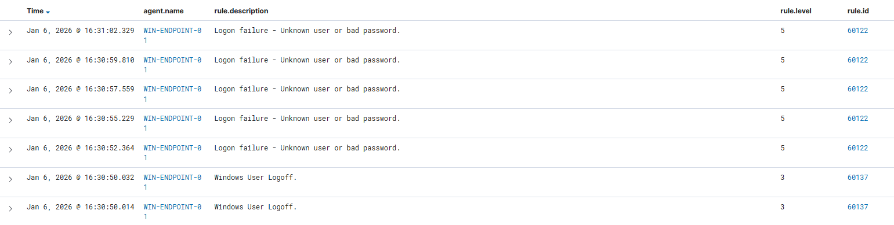

## Summary

Multiple failed login attempts detected on the Windows endpoint. Likely caused by mistyped passwords during lab testing.

## Alert Details

- Rule ID: 60122
- Source Host: WIN-ENDPOINT-01
- User: testuser_lab
- Timestamp: 2026-01-06 16:30
- Severity: Medium

## Investigation Steps

1. Filtered Wazuh Dashboard alerts by Rule ID 60122 and Agent = WIN-ENDPOINT-01.
2. Reviewed the Windows Security Event Logs for login failures.
3. Confirmed 5–10 failed attempts from the same user in a short time frame.

## Findings

- The failed logins were generated intentionally as part of the lab activity.
- No unusual IP addresses or unexpected users were observed.

## Verdict

Lab test — not malicious.

## Recommended Action

- No remediation needed. Document activity in SOC records.
- Use this alert for SIEM dashboard demonstration and analyst training.
