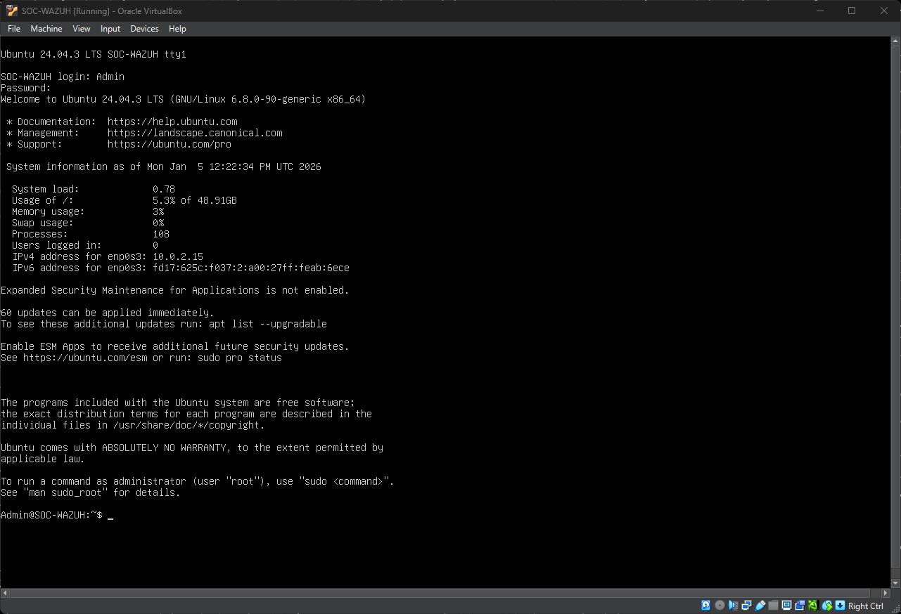
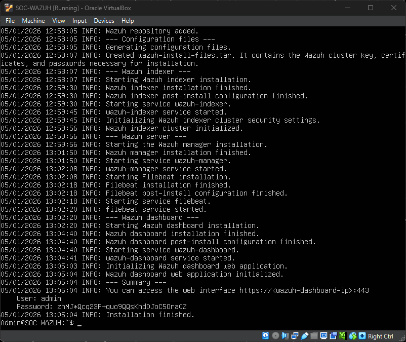
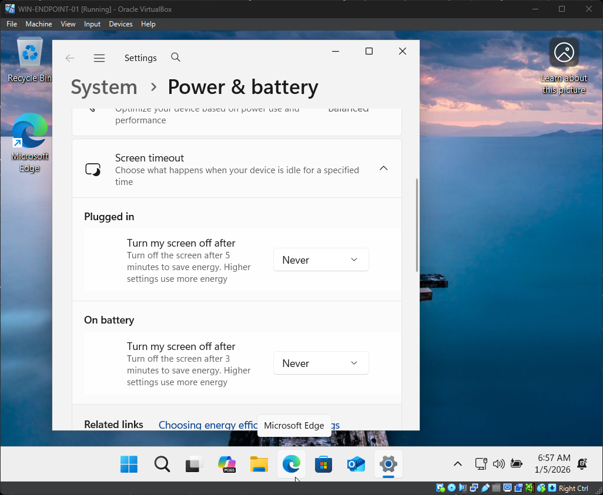
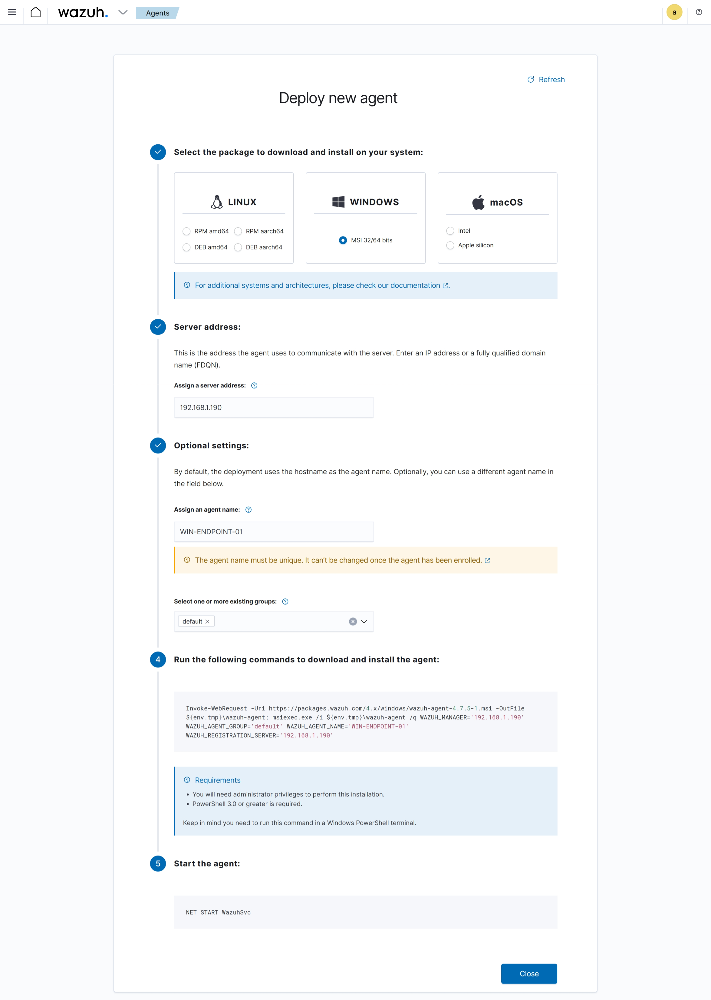
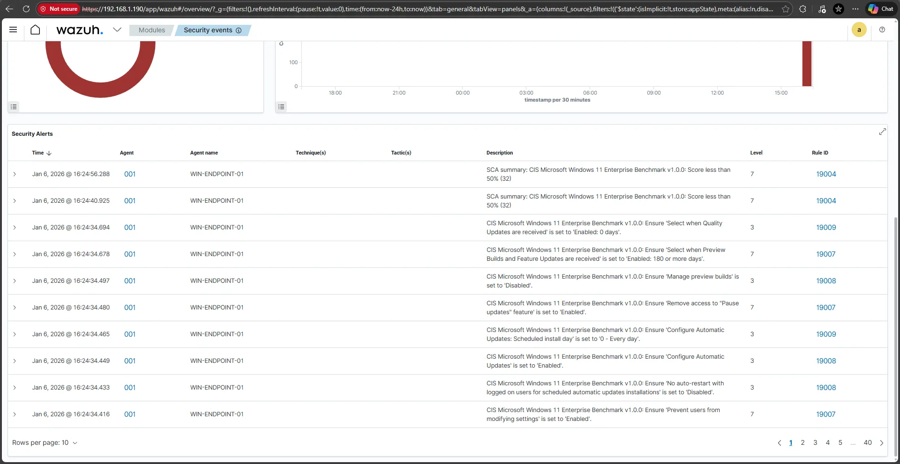
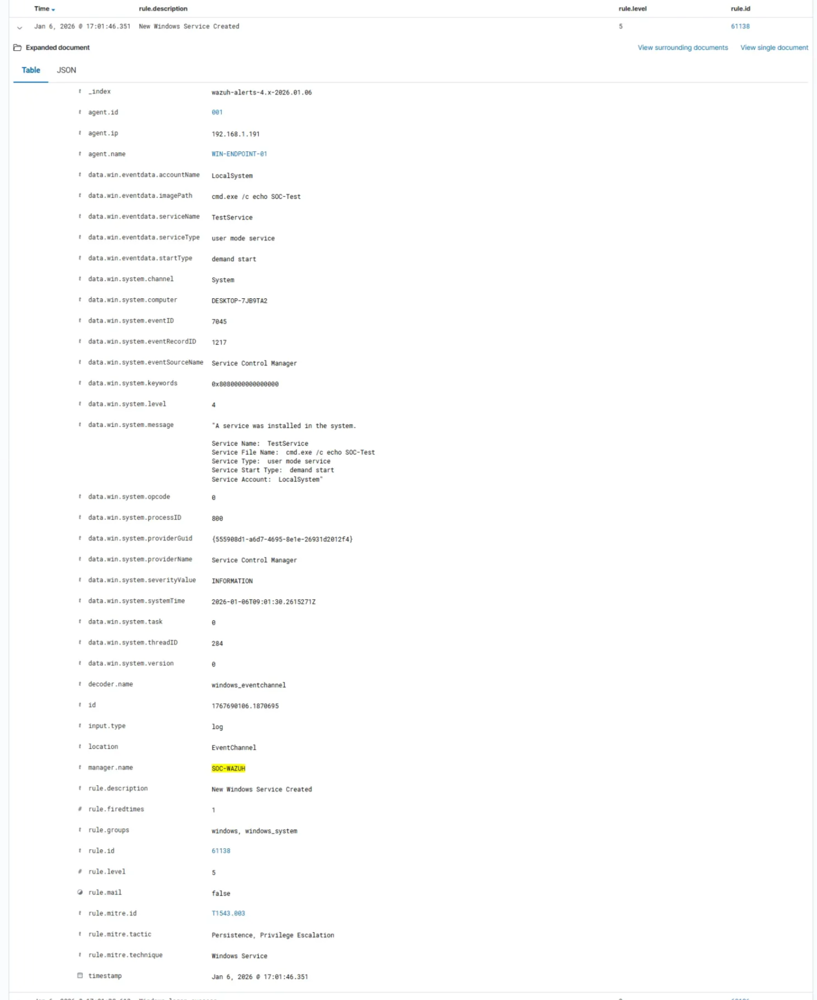

### Step-by-Step

Step 1: Create Ubuntu VM (Wazuh Server)

- Download Ubuntu Server ISO from the web
- Install Ubuntu Server to the VirtualBox
    - Setup:
        - **Name:** `SOC-WAZUH`
        - **OS:** Ubuntu Server 22.04 (Recommended to work with Wazuh)
        - **RAM:** 4–6 GB (minimum 4)
        - **CPU:** 2 cores
        - **Disk:** 50 GB
- Run the Ubuntu Server VM

📸 Screenshot:<br/>



Step 2: Install Wazuh (All-in-One)

- On the Ubuntu VM Terminal:

```bash
### Update system
sudo apt update && sudo apt upgrade -y

### Install Wazuh all-in-one stack
curl -sO https://packages.wazuh.com/4.7/wazuh-install.sh
sudo bash wazuh-install.sh -a
```

- Note the following:
    - Dashboard URL
    - Admin username
    - Admin password

❕Optional:

```bash
### To change admin password:
## Navigate to Wazuh Tools
cd /usr/share/wazuh-indexer/plugins/opensearch-security/tools
## Run the command:
./wazuh-passwords-tools.sh -u Admin -p <password>
```


📸 Screenshot: 



Step 3: Create the Windows Endpoint VM

VM Settings:

- **Name:** `WIN-ENDPOINT`
- **OS:** Windows 11
- **RAM:** 4 GB
- **Disk:** 40 GB
- **Network:** NAT

After Installation:

- Disable Sleep Mode
- Check Internet Access

<aside>
‼️
NOTE: To skip Microsoft Account Log In

- `SHIFT + F10`
- `oobe\bypassnro`
</aside>

📸 Screenshot:



Step 4: Install Wazuh Agent on Windows

- On Windows VM:
    - Open browser
    - Open Wazuh Dashboard
    - Add New Agent
        
        
        
    - Run the Command from Wazuh Dashboard
        
        
        
    - Verification that the Wazuh Agent is Added
        
 📸 Screenshot:


        

Step 5: Confirm Windows Logs Are Arriving

In Wazuh Dashboard:

1. Go to **Security Events**
2. Filter by:
    - Agent name = `WIN-ENDPOINT-01`
3. Look for:
    - Event IDs
    - Log source = Windows

📸 Screenshot:



Step 6: Generate SOC-Relevant Activity

Activity 1: Failed Login Attempts

- Log out of Windows
- Enter wrong password **5–10 times**

📸 Screenshot:


Activity 2: Suspicious PowerShell Execution

Open CMD and run:

```powershell
sc create TestService binPath= "cmd.exe /c echo SOC-Test"
```

📸 Screenshot:



```bash
## To delete the TestService
sc delete TestService
```

Activity 3: New Local User Creation and Added to Administrators Group

1. Open Computer Management
2. Create a new local user
3. Add to Administrators Group

📸 Screenshot:


Step 7: Investigate and Incident Report <br/>
[Incident Reports](../incident-reports)

